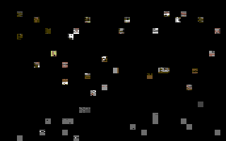
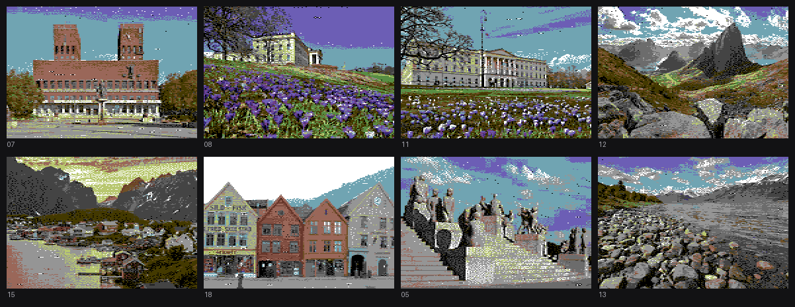
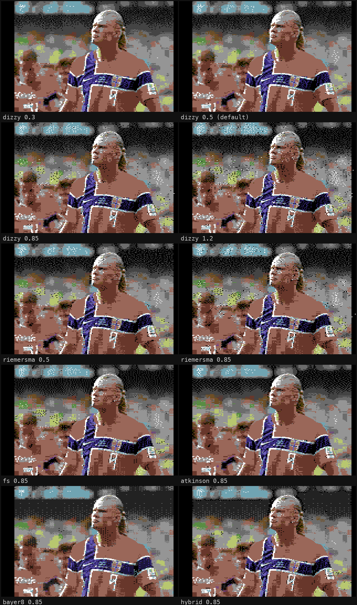
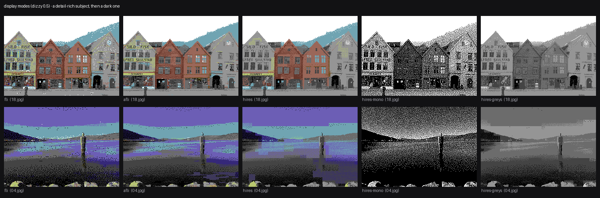

# DitherDeck 64

*A dizzy FLI slideshow for the Commodore 64.*

Turn your photos into a bootable **Commodore 64 slideshow** on a real
1541-compatible disk. Photos are converted to multicolor **FLI** (the C64
demoscene's high-color bitmap mode) with perceptual color matching and
dithering, packed onto a `.d64` with music and dissolve transitions, and
displayed by cycle-exact 6502 code. The quality trick is the pairing of
**FLI** — which multiplies the C64's per-area color freedom eightfold — with
modern **dizzy dithering**; together they produce images that look far
better than a 1982 machine has any right to show.



*A real run: converted slides melting into each other with the actual
dissolve pattern the C64 computes (static holds shortened for the GIF —
render your own with `make_demo_gif.py`).*



- 2–18 photos per disk (ZX0-compressed, loaded by Krill's fast loader)
- slides melt into each other with a randomized cell dissolve — the next
  photo loads *underneath* the running FLI display, so there are no black
  screens, fades, or degraded frames, ever
- in-house 3-voice SID tune plays throughout (swap in your own)
- joystick-2 fire or space skips ahead; **M** mutes/unmutes the music
  (`SCANLINES=1 ./run_emulator.sh` for a CRT look)
- portrait photos are auto-fitted with colored side bars
- slide order: a file named `01.*` goes first, the rest follow EXIF capture time
- verified in VICE (cycle-exact `x64sc` + true drive emulation); built
  for real PAL hardware (C64 + 1541, Ultimate 64, 1541UII) but not yet
  tested on physical iron — see [Real hardware](#real-hardware)

## Quick start

```bash
./go.sh                 # sample photos -> disk image -> VICE
./go.sh my-photos/      # your own directory of 2-18 images
```

`go.sh` runs `setup.sh` on first use, which checks prerequisites and builds
the bundled ZX0 cruncher.

### Prerequisites

You need four things; `setup.sh` checks them and prints the exact install
commands for your platform: the
[ACME](https://sourceforge.net/projects/acme-crossass/) cross-assembler,
[VICE](https://vice-emu.sourceforge.io) (`x64sc`, `c1541`), Python 3
(Pillow + numpy, installed by `setup.sh`), and a C compiler + make for the
bundled ZX0 cruncher.

**macOS**

```bash
brew install acme vice python
xcode-select --install        # C compiler, if you don't have it
./go.sh
```

**Linux** (Debian/Ubuntu shown; Arch/Fedora analogous)

```bash
sudo apt install acme vice build-essential python3 python3-pil python3-numpy
./go.sh
```

Note: Debian/Ubuntu ship VICE without the Commodore ROMs. Grab a VICE
release tarball from [vice-emu.sourceforge.io](https://vice-emu.sourceforge.io)
and copy its `C64/` ROM directory to `~/.local/share/vice/C64/` (or point
`VICE_DATADIR` at it). `c1541` and the build work without ROMs — only the
emulator needs them.

**Windows**

Use **WSL2** (Ubuntu) and follow the Linux steps above — on Windows 11 the
VICE window appears via WSLg automatically. Native Windows is possible
(ACME, VICE, and Python all have Windows builds, and the disk image
`build/slideshow.d64` is fully portable), but the helper scripts are POSIX
shell; you'd run the Python steps by hand and build `dali` with MSYS2/MinGW.
Easiest native route: build the `.d64` in WSL, then open it with the
Windows VICE — or write it straight to real hardware.

## Using your own photos

Drop 2–18 images (JPG/PNG/WebP — plus AVIF/JXL/HEIC with the optional decoders `setup.sh` installs) into a directory and `./go.sh that-dir/`. Each
photo gets a JSON sidecar remembering its conversion settings; tune any
photo and rebuild:

```bash
python3 compare.py my-photos/beach.jpg    # HTML gallery of all option combos
python3 convert.py my-photos/beach.jpg --dither fs --strength 0.7 --sat 1.2 --crop 0,-0.4
python3 preview.py build/pic03.fli        # judge quality without a C64
python3 mkdisk.py --dir my-photos/        # rebuilds only what changed
```

Two portrait photos are automatically combined into one side-by-side slide
(in shot order, with a thin black divider, sized exactly to the FLI frame);
an odd portrait out gets side bars as before.

- `--dither dizzy|fs|atkinson|riemersma|bayer4|bayer8|hybrid` — see
  [Dithering](#dithering) below (default: `dizzy` at strength 0.5)
- `--strength`, `--sat`, `--gamma` — dither amount, saturation, gamma
- `--crop dx,dy` — shift the crop window (−1..1)
- `--pad 0-15` — side-bar color for portrait photos (default 0, black)
- `--mode fli|afli|hires|hires-mono|hires-greys` — per-slide display mode:
  multicolor FLI (default, smoothest color), **AFLI** (hires FLI: 320-wide
  detail *and* per-scanline color — arguably the best photo mode; its
  hardware-garbage left columns are framed by a light grey border), plain
  hires bitmap (2 colors per 8×8 cell), or the hires mono/grey-ladder looks
  (newsprint engraving). Modes mix freely within one deck — the C64
  switches display per slide.

`mkdisk.py --mode afli` sets the mode for the *whole disk*; a photo whose
sidecar pins a mode (because you ran `convert.py --mode ...` on it) keeps
that mode, so "all AFLI except the first slide" is just:

```bash
python3 convert.py photos/sample01.jpg --mode fli
python3 mkdisk.py --dir photos/ --mode afli
```

## Dithering

A C64 sliver offers only four colors, so dithering carries most of the
perceived color depth. The default is **dizzy dithering**
([Liam Appelbe, 2026](https://liamappelbe.medium.com/dizzy-dithering-2ae76dbceba1))
at strength 0.5 — a modern error-diffusion algorithm that visits pixels in
*random order* and hands each pixel's quantization error to whichever
neighbors haven't been processed yet. Because there is no scan direction,
there are none of the directional "worm" artifacts of classic raster-order
diffusion: the grain comes out isotropic and blue-noise-like — organic,
even texture that flatters chunky C64 pixels (and CRTs), keeps flat areas
like skies calm at low strength, and compresses well on disk.

The full menu (`compare.py` renders any photo through all of them):

| mode | character |
|---|---|
| `dizzy` | random-order diffusion; even, direction-free blue-noise grain — the default |
| `fs` | Floyd–Steinberg; maximum detail retention, slight directional texture |
| `atkinson` | Bill Atkinson's MacPaint kernel; deliberately discards ¼ of the error for punchy contrast and very clean highlights |
| `riemersma` | error diffusion along a Hilbert curve ([Riemersma](https://www.compuphase.com/riemer.htm)); organic, clustered grain that follows the curve's wandering path |
| `bayer4`/`bayer8` | ordered matrices; perfectly stable regular patterning, calmest gradients, weakest fine detail |
| `hybrid` | bayer8 in flat regions, FS at edges; a photo-oriented compromise |



Dithering also pairs with the per-slide **display modes** (`--mode`): the
default multicolor FLI trades resolution for color; AFLI keeps hires
resolution *and* changes colors every scanline; standard hires trades
color for resolution; the mono variants turn the dither into the whole
picture — 1-bit newsprint or a smoother grey ladder. All dizzy 0.5 below:



All modes quantize in OkLab against Pepto's measured palette, honor each
sliver's 4-color constraint, and never dither pixels that already sit
exactly on a palette color.

## Real hardware

Write `build/slideshow.d64` to a real disk (Ultimate 64 / 1541UII mount it
directly; ZoomFloppy + nibtools writes physical disks). Boot with
`LOAD"*",8,1` then `RUN`. PAL machines only. SD2IEC does **not** work — the
fast loader runs custom code in the 1541's drive CPU.

> **Heads-up:** not yet verified on physical hardware. All verification so
> far is against VICE's cycle-exact emulation (`x64sc` with true drive
> emulation, which is what the loader and the FLI displayer were developed
> against) — a real C64 + 1541 should behave identically, but until someone
> reports back, consider real-iron status *expected to work, unconfirmed*.
> If you run it on the real thing, please open an issue and tell us!

The music lives in `src/music.asm` as three simple `note,duration` streams —
easy to replace with your own tune.

## How it works

### What is FLI, and why isn't the picture perfectly centered?

A stock C64 multicolor bitmap allows 4 colors per 4×8-pixel cell. **FLI**
(Flexible Line Interpretation, a 1989 demoscene discovery) forces the VIC-II
video chip to re-fetch its color data on *every scanline* — the display
routine rewrites two chip registers per line with cycle-exact timing — so
each 4×1-pixel sliver gets its own 4 colors: eight times the vertical color
resolution. That's what makes photographic material possible at all.

It comes with a famous tax: during those forced re-fetches the chip has no
time to load valid color data for the **first three character columns** of
each line, so they display garbage — the "FLI bug". Every FLI picture ever
made has ~24 dead pixels on the left, and ours paints them black so they
merge into the border. Because 24 black pixels on the left alone would push
the visible picture 12 pixels right of center, the converter also blanks
the rightmost column: the 288-pixel picture then sits within 4 pixels of
true center — close enough that the eye reads it as centered. So the black
stripes aren't padding or a bug in this tool: they're the VIC-II's toll,
arranged as symmetrically as the hardware allows.

### The rest of the pipeline

Photos are matched against the measured C64 palette in OkLab color space,
attributes are optimized per FLI color slot, and the result is packed into
a trimmed format that a 6502 routine unpacks in place. On the C64, a
stable-raster IRQ forces a *late* badline on every scanline (the trick that
makes FLI's row counter work), while Krill's loader streams the next
picture in underneath the live display. The gory details, including several
hard-won hardware facts, are in [TECHNICAL.md](TECHNICAL.md).

## Credits

- **Loader by [Krill](https://csdb.dk/scener/?id=8104)** — the vendored
  [Krill's Loader, repository version 194](https://csdb.dk/release/?id=226124)
  does all disk I/O and on-the-fly ZX0 decompression (see
  `src/loader/VERSION` and its license in `src/loader/loader/README`)
- **ZX0** compression format by Einar Saukas; crunched with **dali** /
  **salvador** by Emmanuel Marty (bundled with Krill's loader)
- **Pepto's** measured VIC-II palette (Philip Timmermann,
  [pepto.de/projects/colorvic](https://www.pepto.de/projects/colorvic/))
- **ACME** cross-assembler and **VICE** emulator teams
- **Dizzy dithering** algorithm by
  [Liam Appelbe](https://liamappelbe.medium.com/dizzy-dithering-2ae76dbceba1);
  **Riemersma dithering** by
  [Thiadmer Riemersma](https://www.compuphase.com/riemer.htm)
- Sample photos served by [picsum.photos](https://picsum.photos)
  (Unsplash-licensed images)
- Built by [aastroem](https://github.com/aastroem) with
  [Claude](https://claude.com) (Anthropic's Claude Code) doing the heavy
  lifting — from the OkLab converter to the cycle-exact FLI displayer

## License

MIT for everything in this repository except the vendored third-party code
under `src/loader/` — see [LICENSE](LICENSE).
